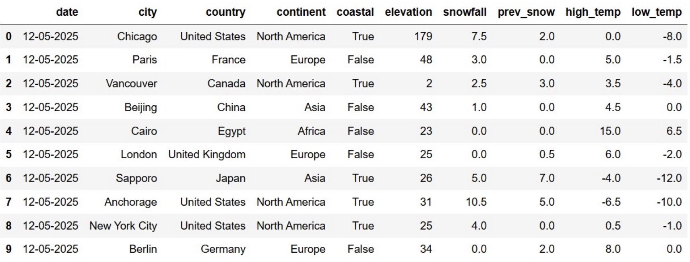

Winter is coming, and everyone is feeling the colder weather. In the DataFrame `snow`, each row corresponds to a city-date combination representing the weather conditions in that city on a particular day. The DataFrame is sorted by date in reverse chronological order, with cities in no particular order. The columns are:

- `"date"` (`str`): The date of the observation.
- `"city"` (`str`): The name of the city. Each city in our data set has a different name.
- `"country"` (`str`): The country in which the city is located.
- `"continent"` (`str`): The continent in which the city is located.
- `"coastal"` (`bool`): Whether the city is located on a coast.
- `"elevation"` (`int`): The elevation of the city, measured in meters.
- `"snowfall"` (`float`): The amount of snow that fell in the city on that day, measured in centimeters.
- `"prev_snow"` (`float`): The amount of snow on the ground before the snow fell in the city on that day, measured in centimeters.
- `"high_temp"` (`float`): The highest temperature in the city on that day, measured in degrees Celsius.
- `"low_temp"` (`float`): The lowest temperature in the city on that day, measured in degrees Celsius.

The first ten rows of `snow` are shown below. The full DataFrame has many additional rows.

 

Throughout this exam, assume that we have already run `import babypandas as bpd`, `import numpy as np`, and `import scipy`.