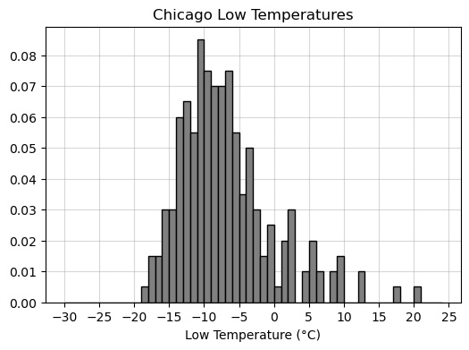

# BEGIN PROB

Chicago, nicknamed the "Windy City," reaches some pretty low temperatures. Define the variable `chi_low` as follows.

```py
chi_low = snow[snow.get("city") == "Chicago"].get("low_temp")
```

# BEGIN SUBPROB

<!-- **(3 pts)** -->

Without making any assumptions about the data in `chi_low`, determine the minimum proportion of values that lie within 3 standard deviations of the mean. Give your answer as a **simplified fraction**.

# BEGIN SOLUTION

**Answer:** $\frac{8}{9}$

Since we have made no assumptions about the data, we use Chebyshev's inequality. We want to be within 3 SDs of the mean. Therefore, the proportion is:

$$1 - \frac{1}{3^2} = 1 - \frac{1}{9} = \frac{8}{9}$$

# END SOLUTION

# END SUBPROB

# BEGIN SUBPROB

<!-- **(3 pts)** -->

You are told that the mean of `chi_low` is $-7^\circ$C and the standard deviation is $6^\circ$C. Define a variable `x` such that `x.mean()` calculates the actual proportion of values that lie within 3 standard deviations of the mean.

```py
x = ___
```

# BEGIN SOLUTION

**Answer:** `(chi_low >= -25) & (chi_low <= 11)` or `(chi_low >= -7 - 6 * 3) & (chi_low <= -7 + 6 * 3)` or `-25 <= chi_low <= 11` or equivalent

The mean is $-7$ and the SD is $6$. Thus the range that is within 3 SDs of the mean is given by

$$[-7 - 3 \cdot 6,\ -7 + 3 \cdot 6] = [-7 - 18,\ -7 + 18] = [-25, 11]$$

If `x` is a Boolean series, then taking the mean of `x` is equivalent to finding the proportion of `True` values in `x`. (Recall that `True = 1` and `False = 0`, so taking the mean is equivalent to counting all instances of `True` then dividing by the total number of entries in the Series.)

All answer options above create a Boolean series `x` that checks whether each entry in `chi_low` belongs to the range $[-25, 11]$. As a result, `x.mean()` will tell us the proportion of values within 3 SDs of the mean.

# END SOLUTION

# END SUBPROB

# BEGIN SUBPROB

<!-- **(3 pts)** -->

You're now given a density histogram with the full distribution of data in `chi_low`. Recall this data has a mean of $-7^\circ$C and a standard deviation of $6^\circ$C. 

<center></center>

Use the histogram to calculate the proportion of values that lie within 3 standard deviations of the mean. Your answer should be a **number between 0 and 1, to two decimal places**.

# BEGIN SOLUTION

**Answer:** 0.98

We use our answer to part (b) and check the proportion of values that belong to the interval $[-25, 11]$. Note that **all** values are at least as large as $-25$. However, there are three "bars" that lie above 11. These are the values that lie outside 3 SDs of the mean. If we find the proportion of values represented in these three bars, we can subtract this proportion from 1 to find the proportion of values that lie **within** 3 SDs of the mean.

To compute proportion, we find the area of each bar. The width of each bar is 1, and the heights of the three bars are 0.01, 0.005, 0.005 (approximately). Their total area is therefore:

$$1(0.01 + 0.005 + 0.005) = 0.02$$

Hence $1 - 0.02 = 0.98$ is the proportion of values within 3 SDs of the mean.

# END SOLUTION

# END SUBPROB

# BEGIN SUBPROB

<!-- **(2 pts)** -->

On the warmest Chicago day recorded in `snow`, the low temperature was $20^\circ$C. Express this temperature in standard units relative to other Chicago lows. Give your answer as an **exact decimal**.

# BEGIN SOLUTION

**Answer:** 4.5

Recall the formula for $x$ in standard units:

$$\frac{x - \text{mean}}{\text{SD}}$$

When $x = 20$, mean is $-7$, and SD is $6$, the corresponding value in standard units is:

$$\frac{20 - (-7)}{6} = \frac{27}{6} = \frac{9}{2} = 4.5$$

# END SOLUTION

# END SUBPROB

# BEGIN SUBPROB

<!-- **(3 pts)** -->

Suppose we collected four times as much data as currently depicted in the histogram above, then plotted a new histogram of the larger data set. How would we expect the standard deviation of temperatures to change?

( ) Decrease by a factor of 4.
( ) Decrease by a factor of 2.
( ) No substantial change.
( ) Increase by a factor of 2.
( ) Increase by a factor of 4.

# BEGIN SOLUTION

**Answer:** No substantial change.

Note that this is **not** a distribution of sample statistics, but a distribution of a sample itself. Hypothetically, if we collected many more individual low temperatures, we would expect them to be distributed similarly to our current sample. Thus, the SD will stay generally the same.

(It would also help to recall that the sample standard deviation can be used to approximate the population standard deviation. Thus, if the initial sample size is "large enough," increasing the sample size should not substantially change the approximation of the population standard deviation.)

# END SOLUTION

# END SUBPROB

# BEGIN SUBPROB

<!-- **(3 pts)** -->

What kind of distribution does the histogram depict?

( ) Probability distribution.
( ) Empirical distribution.
( ) Categorical distribution.
( ) None of the above.

# BEGIN SOLUTION

**Answer:** Empirical distribution.

The probability distribution is a theoretical model and is generally not known. Since we only have a sample of low temperatures, there are many more not included in the distribution. Thus, the histogram cannot represent the true probability distribution.

This is not a categorical distribution because `"low_temp"` is a quantitative variable.

This **is** an empirical distribution, because it depicts the distribution of our observed data.

# END SOLUTION

# END SUBPROB

# END PROB
