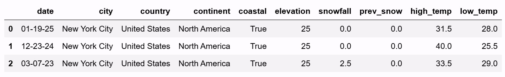

# BEGIN PROB

As a resident of New York City, you suspect that your local news channel tends to overestimate the percent chance of snow in its daily weather forecast. To investigate this, you look at historical weather forecasts, and decide to focus specifically on days in which your local news channel had predicted a 40% chance of snow. With the benefit of hindsight, you can now see whether it actually snowed on 40% on those days.

The DataFrame `snow` has been queried to contain only those days that had a 40% predicted chance of snow, for New York City, stored in a new DataFrame called `snow_nyc40`. A few rows of `snow_nyc40` are shown below, but there are more rows not pictured.

<center></center>

You set out to test the following hypotheses:

- **Null:** It actually snows on 40% of days for which the local news channel predicts a 40% chance of snow.
- **Alternative:** It actually snows on less than 40% of days for which the local news channel predicts a 40% chance of snow.

# BEGIN SUBPROB

<!-- **(5 pts)** -->

Fill in the blanks in the code below, which should calculate an observed test statistic, generate an empirical distribution of this test statistic under the null hypothesis, and calculate a p-value for the hypothesis test.

```py
obs_stat = np.count_nonzero(snow_nyc40.get("snowfall"))
counts = np.array([])
for i in np.arange(10000):
    new_count = __(a)__
    counts = np.append(counts, new_count)
p_value = np.count_nonzero(counts __(b)__ obs_stat) / len(counts)
```

<!-- **(a):**

**(b):** Select one: `>` `>=` `<` `<=` `==` `!=` -->

# BEGIN SOLUTION

**Answer (a):** `np.random.multinomial(snow_nyc40.shape[0], [0.4, 0.6])[0]`

**Answer (b):** `<=`

If it snows on a day, the corresponding entry in `"snowfall"` will be greater than 0. We have a proposed distribution under the null hypothesis, which can be described as 40% days with more than zero snowfall, and 60% days with zero snowfall. To simulate counts, according to this null hypothesis, we can use `np.random.multinomial()`. Note that since we are comparing counts, we must use the same total as our original sample, `snow_nyc40` which is given by `snow_nyc40.shape[0]`.

Our alternative states that less than 40% of days are snow days. Note that `obs_stat` is computing the number of days in `snow_nyc40` that experienced more than zero snowfall. So, test statistics that are smaller than or equal to the observed will be in favor of the alternative hypothesis.

# END SOLUTION

# END SUBPROB

# BEGIN SUBPROB

<!-- **(4 pts)** -->

You want to test the same pair of hypotheses another way, using a different test statistic and rewriting the code in part (a). Which of the following could be the observed statistic for a new hypothesis test for the same pair of hypotheses? **Select all that apply.**

[ ] `np.count_nonzero(snow_nyc40.get("snowfall") == 0)`
[ ] `(snow_nyc40.get("snowfall") > 0).sum() / snow_nyc40.shape[0]`
[ ] `(snow_nyc40.get("snowfall") > 0).mean() - 0.40`
[ ] `(snow_nyc40.get("snowfall")).sum() / snow_nyc40.shape[0]`
[ ] None of the above.

# BEGIN SOLUTION

**Answer:** `np.count_nonzero(snow_nyc40.get("snowfall") == 0)`, `(snow_nyc40.get("snowfall") > 0).sum() / snow_nyc40.shape[0]`, and `(snow_nyc40.get("snowfall") > 0).mean() - 0.40`

The first choice can be used to test the following alternative: "There is no snowfall on more than 60% of the days for which the news predicts a 40% chance of snow." This is equivalent to our original alternative hypothesis.

The second choice simply converts the original test statistic (a count) into its corresponding proportion, which isn't going to affect our hypotheses.

The third choice also converts the test statistic into a proportion (using `mean()`). It additionally subtracts a constant. Since 0.40 is subtracted from all test statistics, however, the conclusion we make will not change and thus the corresponding hypotheses remain the same.

Note that `snow_nyc40.get("snowfall")` is not a Boolean series, therefore `snow_nyc40.get("snowfall").sum()` will not help us determine whether (fewer than) 40% of days are snow days.

# END SOLUTION

# END SUBPROB

# BEGIN SUBPROB

<!-- **(3 pts)** -->

You also calculate a 95% CLT-based confidence interval for the proportion of days on which it actually snowed in New York City, among those for which a 40% chance of snow was predicted. Your confidence interval comes out to $[0.17, 0.32]$. Which of the following conclusions is correct?

( ) Because this confidence interval does not contain the value of 0.50, it indicates that the p-value from the hypothesis test above should be below 0.05.
( ) Because this confidence interval does not contain the value of 0.40, it indicates that the p-value from the hypothesis test above should be below 0.05.
( ) Because this entire interval is above 0, it indicates that the p-value from the hypothesis test above should be above 0.05.
( ) There is no connection between this confidence interval and the hypothesis test because the Central Limit Theorem does not apply in this situation.
( ) There is no connection between this confidence interval and the hypothesis test because this confidence interval is for a proportion and the hypothesis test was performed with counts.

# BEGIN SOLUTION

**Answer:** Because this confidence interval does not contain the value of 0.40, it indicates that the p-value from the hypothesis test above should be below 0.05.

We can use CLT since we are working with proportions. Hence, the 95% CLT-based confidence interval for the population parameter (the true proportion) can be used to reject/fail to reject the null hypothesis. Since 0.4 (the proposed proportion under the null) does not belong in our CLT-based confidence interval for the true proportion, it lies in the $(100 - 95)\% = 5\%$ region not contained by the confidence interval. The p-value of the hypothesis test must therefore be smaller than 0.05.

# END SOLUTION

# END SUBPROB

# END PROB
