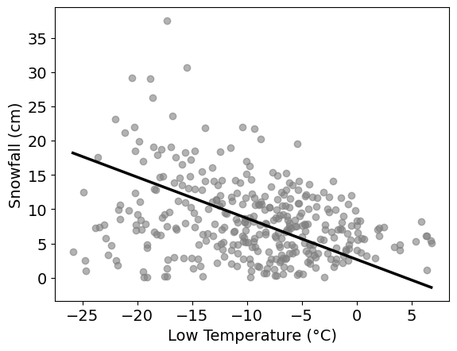

# BEGIN PROB

Pranav works for a ski resort and is curious about the relationship between the daily low temperature (°C) and snowfall (cm). He collects his own data set, recording each of these variables over a period of many days, and storing them in arrays `low_temp` and `snowfall`, respectively. He decides to use linear regression to predict `snowfall` from `low_temp`. His regression line is shown below on a scatterplot of the data.

<center></center>

# BEGIN SUBPROB

<!-- **(3 pts)** -->

The correlation between low temperature and snowfall at the ski resort is $-0.4$. The standard deviation of low temperature is $6°C$ and the standard deviation of snowfall is $9$cm. What is the slope of the regression line predicting snowfall from temperature?

( ) $-0.4$
( ) $-0.5$
( ) $-0.6$
( ) $-0.7$

# BEGIN SOLUTION

**Answer:** $-0.6$

Recall that the slope of a linear regression line can be computed as follows:

$$\text{slope} = r \cdot \frac{\text{SD}_y}{\text{SD}_x}$$

where $r$ is the correlation, $\text{SD}_x$ is the standard deviation of the $x$ variable (independent/explanatory variable), and $\text{SD}_y$ is the standard deviation of the $y$ variable (dependent/response variable).

From the plot, we can see that $x$ is the Low Temperature, and $y$ is the Snowfall. Plugging in the corresponding values:

$$\text{slope} = -0.4 \cdot \frac{9}{6} = -\frac{2}{5} \cdot \frac{9}{6} = -\frac{2}{5} \cdot \frac{3}{2} = -\frac{3}{5} = -0.6$$

# END SOLUTION

# END SUBPROB

# BEGIN SUBPROB

<!-- **(3 pts)** -->

You are now told that the intercept of the regression line is 3. Which of the following is the correct interpretation of the intercept?

( ) The average snowfall in the dataset is 3cm.
( ) When the snowfall is 0cm, the predicted temperature is $3°C$.
( ) When the temperature is $0°C$, the predicted snowfall is 3cm.
( ) The intercept has no interpretable meaning in this context.

# BEGIN SOLUTION

**Answer:** When the temperature is $0°C$, the predicted snowfall is 3cm.

We are predicting snowfall using temperature. Our regression line is given by $\hat{y} = mx + b$, where $m$ is the slope, $b = 3$ is the intercept, $x$ represents the lowest temperature, and $\hat{y}$ represents the predicted snowfall. If we let $x = 0$, then $\hat{y} = m(0) + 3 = 3$. Indeed, the predicted snowfall ($\hat{y}$) is 3cm when temperature ($x$) is $0°C$.

# END SOLUTION

# END SUBPROB

# BEGIN SUBPROB

<!-- **(3 pts)** -->

Estimate the value of the largest residual. Give your answer as an **integer, to the nearest multiple of 5**.

# BEGIN SOLUTION

**Answer:** 25

For a temperature-snowfall pair $(x_i, y_i)$, let $y_i$ be the actual snowfall and $\hat{y}_i$ be the **predicted** snowfall when you input $x_i$ into the regression line $\hat{y} = mx + b$. The residual is given by the following:

$$y_i - \hat{y}_i$$

Our primary goal is to find a temperature-snowfall pair where the prediction $\hat{y}_i$ is the "farthest off" from the actual value $y_i$. If you observe low temperatures within the range $[-20, -15]$, there is a snowfall value that is considerably "farther away" from the regression line compared to all other points. The point is approximately located at $(-17.5, 40)$, where 40 is the actual snowfall. We compare this to the value of the regression line at approximately $x = -17.5$. Since we are rounding to the nearest multiple of 5, we visually approximate the value on the regression line as $(-17.5, 15)$. The residual is therefore $40 - 15 = 25$.

# END SOLUTION

# END SUBPROB

# BEGIN SUBPROB

<!-- **(3 pts)** -->

Which of the following best describes what the residual plot would look like?

( ) Residuals increase steadily as temperature increases.
( ) Residuals form a bowl shape (curved, high on both ends).
( ) Residuals have more vertical spread on the left than on the right.
( ) Residuals show no pattern and have constant vertical spread throughout.

# BEGIN SOLUTION

**Answer:** Residuals have more vertical spread on the left than on the right.

A trick you can use to visualize residuals is to angle your vision such that the linear regression line becomes "horizontal." Then, imagine that the "horizontal" regression line is the $x$-axis and the points around it are the residuals.

We can see that the residuals become more "vertically squeezed together" in the plot as you travel left to right along the regression line. This is equivalent to saying that residuals have more vertical spread (variation) on the left than on the right.

# END SOLUTION

# END SUBPROB

# BEGIN SUBPROB

<!-- **(4 pts)** -->

Which of the following conclusions are valid? **Select all that apply.**

[ ] The variability of the residuals changes with temperature.
[ ] A curved model (such as a quadratic) would clearly fit this data better than a line.
[ ] A different prediction line could eliminate the pattern seen in the errors.
[ ] The linear model is appropriate, but prediction uncertainty is not constant across temperatures.
[ ] None of the above.

# BEGIN SOLUTION

**Answer:** The variability of the residuals changes with temperature. The linear model is appropriate, but prediction uncertainty is not constant across temperatures.

The first choice follows from our answer to part (d). If residuals have more vertical spread on the left than on the right, this implies that lower temperatures indicate higher variability in residuals than higher temperatures. In other words, we can expect variability of residuals to decrease as temperature increases.

A quadratic/curved model would require a quadratic/curved shape in the original data. However, from our plot, it is **unclear** whether such a model will fit better than linear regression. As a result, we cannot select this choice.

The pattern seen in the errors is heteroskedasticity, with bigger spread at lower values of Low Temperature and smaller spread at higher values of Low Temperature. This is due to the fact that the variability in snowfall is greater at lower values of Low Temperature than it is at higher values of Low Temperature. Therefore, any other prediction line would not be able to change this pattern.

The linear model is appropriate because there does appear to be a linear relationship between Low Temperature and Snowfall. Due to the greater variability at lower values of Low Temperature, however, the prediction uncertainty is greater at those values than it is at higher values of Low Temperature.

# END SOLUTION

# END SUBPROB

# BEGIN SUBPROB

<!-- **(5 pts)** -->

Pranav converts `low_temp` from Celsius to Fahrenheit using the code below.

```py
low_temp_f = 1.8 * low_temp + 32
```

Which of the following quantities changes as a result? **Select all that apply.**

[ ] The slope of the regression line.
[ ] The intercept of the regression line.
[ ] The correlation coefficient.
[ ] The root mean square error of the regression line.
[ ] The predicted snowfall values for each day.
[ ] None of the above.

# BEGIN SOLUTION

**Answer:** The slope of the regression line. The intercept of the regression line.

The slope depends on the standard deviation of `low_temp`. Note that, by properties of variance:

$$\text{Var}(1.8 \cdot \texttt{low\_temp} + 32) = 1.8^2 \text{Var}(\texttt{low\_temp})$$

Hence the new standard deviation of `low_temp_f` is

$$\text{SD}_{(°F)} = \sqrt{1.8^2 \text{Var}(\texttt{low\_temp})} = 1.8 \cdot \text{SD}_{(°C)}$$

which is different.

The intercept is also affected by the transformation because it uses the mean of `low_temp_f`. The mean using Fahrenheit is clearly different from the mean when using Celsius:

$$\text{mean}_{(°F)} = \text{mean}(1.8 \cdot \texttt{low\_temp} + 32) = 1.8 \cdot \text{mean}(\texttt{low\_temp}) + 32 = 1.8 \cdot \text{mean}_{(°C)} + 32$$

By definition, the correlation is the average value of the product of $x$ and $y$ when both are measured in standard units. Let $x_{(°F)} = 1.8 \cdot x_{(°C)} + 32$ be the temperature in Fahrenheit and $x_{(°C)}$ be the temperature in Celsius. Let $z_{(°F)}$ and $z_{(°C)}$ be the standard units of $x_{(°F)}$ and $x_{(°C)}$, respectively. Observe that:

$$z_{(°F)} = \frac{x_{(°F)} - \text{mean}_{(°F)}}{\text{SD}_{(°F)}} = \frac{x_{(°F)} - 1.8 \cdot \text{mean}_{(°C)} - 32}{1.8 \cdot \text{SD}_{(°C)}} = \frac{1.8 \cdot x_{(°C)} + 32 - 1.8 \cdot \text{mean}_{(°C)} - 32}{1.8 \cdot \text{SD}_{(°C)}} = \frac{x_{(°C)} - \text{mean}_{(°C)}}{\text{SD}_{(°C)}} = z_{(°C)}$$

Therefore, the standard units are equal after the transformation, and thus the correlation will also stay the same.

Note that errors are computed using the predicted values. Since we're predicting snowfall and only transforming the `low_temp` values, our actual snowfall values (predicted and actual) will not change. Therefore, RMSE will stay the same if we only transform the temperature variable.

As before, we are not transforming our snowfall values. We are only transforming temperature. Therefore, our predictions will stay the same.

# END SOLUTION

# END SUBPROB

# BEGIN SUBPROB

<!-- **(3 pts)** -->

Pranav performs the following bootstrapping procedure:

1. Resample the original dataset with replacement to create a bootstrap resample of the same size.
2. Fit a regression line predicting `snowfall` from `low_temp` using the bootstrap resample.
3. Calculate the sum of the slope and intercept of this regression line.
4. Repeat these steps 5,000 times, producing 5,000 values.

What does one of the 5,000 values represent?

( ) The most likely snowfall amount on a day with a low temperature of $1°C$.
( ) The most likely snowfall amount on a day with a low temperature of $0°C$.
( ) A predicted snowfall value at $1°C$ produced by one bootstrap regression line.
( ) A predicted snowfall value at $0°C$ produced by one bootstrap regression line.
( ) The average snowfall on all days where the low temperature was $1°C$.
( ) The average snowfall on all days where the low temperature was $0°C$.

# BEGIN SOLUTION

**Answer:** A predicted snowfall value at $1°C$ produced by one bootstrap regression line.

In essence, the question is asking us to interpret what the sum of the slope and intercept is. In our regression line,

$$\hat{y} = mx + b$$

where $\hat{y}$ is the predicted snowfall, $x$ is the Lowest Temperature, $m$ is the slope, and $b$ is the intercept. Notice that if we set $x = 1$, then we get $m + b$, which is precisely the sum of the slope and intercept. Since $x = 1$ refers to the temperature, this means that the sum of the slope and intercept is the predicted snowfall when temperature is $1°C$. Since we're bootstrapping, this is one such prediction made by producing a bootstrapped regression line.

# END SOLUTION

# END SUBPROB

# END PROB
