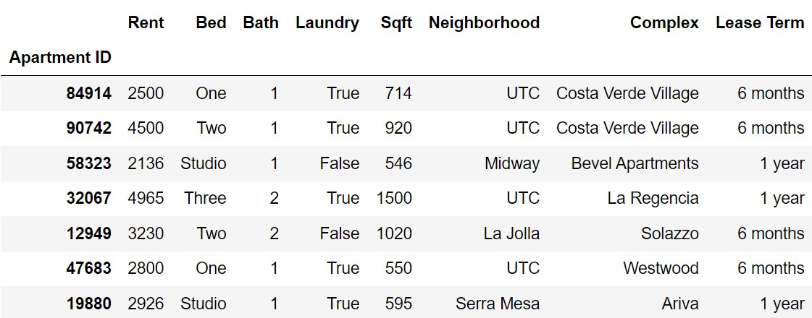

In this final, we'll explore data on 800 different apartments available for rent in San Diego. Each row in the DataFrame `apts` corresponds to an individual apartment. The DataFrame is indexed by `"Apartment ID"` (`int`), which is a unique identifier for the apartment. 

The columns of `apts` are as follows:

-   `"Rent"` (`int`): The monthly rent for the apartment, in dollars. 
-   `"Bed"` (`str`): The number of bedrooms in the apartment. Values are `"Studio"`, `"One"`, `"Two"`, and `"Three"`. 
-   `"Bath"` (`int`): The number of bathrooms in the apartment. Values are `"One"`, `"One and a half"`, `"Two"`, `"Two and a half"`, and `"Three"`.
-   `"Laundry"` (`bool`): If the apartment comes with an in-unit washer and dryer.
-   `"Sqft"` (`int`): The area of the apartment, in square feet. 
-   `"Neighborhood"` (`str`): The neighborhood in which the apartment is located.
-   `"Complex"` (`str`): The complex the apartment is a part of.
-   `"Lease Term"` (`str`): The duration of the apartment's lease.  Values are `"1 month"`, `"6 months"`, and `"1 year"`. 

The first few rows of `apts` are shown below, though `apts` has many more rows than pictures, 800 in total. The data in `apts` is only a sample from the much larger population of **all** San Diego apartments.

 

Throughout this exam, assume that we have already run `import babypandas as bpd` and `import numpy as np`.