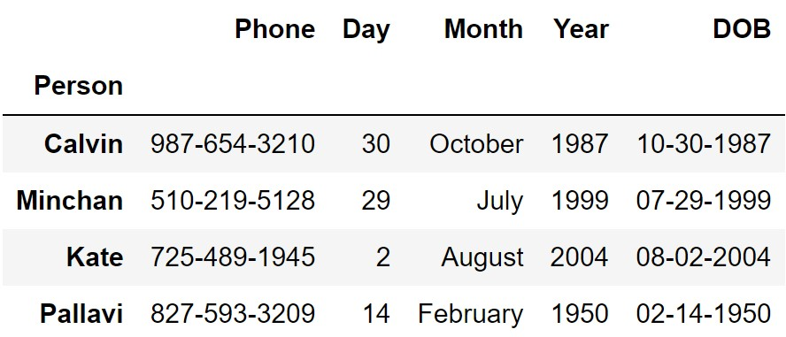

In this exam, you'll work with a data set representing your phone's
contact list. `contacts` is indexed by `"Person"`. You store each person
in your contacts under a unique name.

The columns of `contacts` are as follows:

-   `"Phone"` (`str`): Your contact's phone number, formatted like
    `"xxx-xxx-xxxx"`, where each `x` represents a digit 0 through 9. All
    of your contacts have distinct phone numbers.

-   `"Day"` (`int`): The day of the month your contact was born. Values
    are 1 through 31.

-   `"Month"` (`str`): The month your contact was born.

-   `"Year"` (`int`): The year your contact was born.

-   `"DOB"` (`str`): Your contact's date of birth, in the form
    `"MM-DD-YYYY"`.

The first few rows of `contacts` are shown below, though `contacts` has
many more rows than pictured.

Throughout this exam, we will refer to `contacts` repeatedly.

Assume that we have already run `import babypandas as bpd` and
`import numpy as np`.
