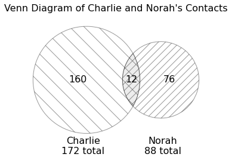

# BEGIN PROB

Suppose Charlie and Norah each have separate DataFrames for their
contacts, called `charlie` and `norah`, respectively. These DataFrames
have the same column names and format as your DataFrame, `contacts`.

As illustrated in the diagram below, Charlie has 172 contacts in total,
whereas Norah has 88 contacts. 12 of these contacts are shared, meaning
they appear in both `charlie` and `norah`.

<center></center>

# BEGIN SUBPROB

What does the following expression evaluate to?

```py
charlie.merge(norah, left_index=True, right_index=True).shape[0]    
```

# BEGIN SOLUTION

**Answer:** $12$

The code merges DataFrames `charlie` and `norah` on their indexes, so the resulting DataFrame will contain one row for every match between their indexes ('Person' since they follow the same format as DataFrame `contact`). From the Venn Diagram, we know that Charlie and Norah have 12 contacts in common, so the resulting DataFrame will contain 12 rows: one row for each shared contact. 

Thus, `charlie.merge(norah, left_index=True, right_index=True).shape[0]` returns the row number of the resulting DataFrame, which is 12.    

<average>66</average>

# END SOLUTION

# END SUBPROB

# BEGIN SUBPROB

One day, when updating her phone's operating system, Norah accidentally
duplicates the 12 contacts she has in common with Charlie. Now, the
`norah` DataFrame has 100 rows.

What does the following expression evaluate to?

```py
norah.merge(norah, left_index=True, right_index=True).shape[0]   
``` 

# BEGIN SOLUTION

**Answer:**  $24 \cdot 2 + 76 = 124$

Since Norah duplicates 12 contacts, the `norah` DataFrame now has 76 unique rows + 12 rows + 12 duplicated rows. Note that the above code is now merging norah with itself on indexes. 

After merging, the resulting DataFrame will contain 76 unique rows, as there is only one match for each unique row. As for the duplicated rows, each row can match twice, and we have 24 rows.  Thus the resulting DataFrame's row number $= 76 + 2 \cdot 24 = 124$. 

For better understanding, imagine we have a smaller DataFrame `nor` with only one contact Jim. After duplication, it will have two identical rows of Jim. For easier explanation, let's denote the original row Jim1, and duplicated row Jim2. When merging Nor with itself, Jim1 can be matched with Jim1 and Jim2, and Jim2 can be matched with Jim1 and Jim2, resulting $= 2 \cdot 2 = 4 $ number of rows. 

<average>3</average>

# END SOLUTION

# END SUBPROB

# END PROB
