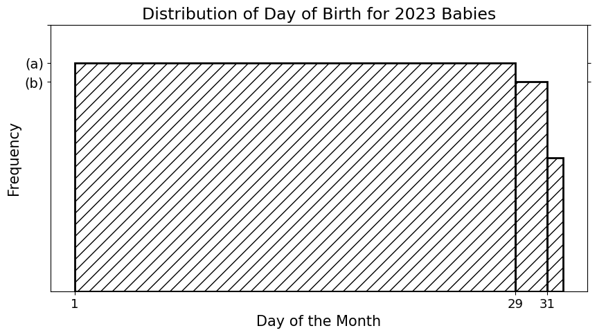

# BEGIN PROB

After looking at the distribution of `"Day"` for your contacts, you
wonder how that distribution might look for other groups of people.

In this problem, we will consider the distribution of day of birth (just
the day of the month, not the month or year) for all babies born in the
year 2023, under the assumption that all babies born in 2023 were
equally likely to be born on each of the 365 days of the year.

The density histogram below shows this distribution.

**Note:** 2023 was not a leap year, so February had 28 days.

# BEGIN SUBPROB

What is height `(a)`?

( ) $\dfrac{1}{28}$ 
( ) $\dfrac{28}{365}$ 
( ) $\dfrac{12 \cdot 28}{365}$
( ) $\dfrac{1}{12}$ 
( ) $\dfrac{12}{365}$ 
( ) $1$

# BEGIN SOLUTION

**Answer:** $\dfrac{12}{365}$ 

2023 was not a leap year, so there are in total 365 days, and February only has 28 days. All the months have at least 28 days, so in bin [1,29], there are 12 * 28 data values. And, all the months other than February have 29th and 30th days, so there are 2 * 11 data values in bin [29,31]. Lastly, there are 7 months with 31 days, so there are 7 data values in bin [31,32]. 

There are in total 365 data values, so the proportion of data points falling into bin [1,29] $=\dfrac{12 \cdot 28}{365}$. 
Thus, the area of the bar of bin [1,29] $= \dfrac{12 \cdot 28}{365}$. 
Area = Height * Width, width of the bin is 28, so height(a) $= \dfrac{12 \cdot 28}{365 \cdot 28} = \dfrac{12}{365}$.

<average>38</average>

# END SOLUTION

# END SUBPROB

# BEGIN SUBPROB

Express height `(b)` in terms of height `(a)`.

( ) $\text{(b)} = \dfrac{7}{12} \cdot \text{(a)}$
( ) $\text{(b)} = \dfrac{27}{28} \cdot \text{(a)}$
( ) $\text{(b)} = \dfrac{28}{29} \cdot \text{(a)}$
( ) $\text{(b)} = \dfrac{11}{12} \cdot \text{(a)}$
( ) $\text{(b)} = \dfrac{7}{11} \cdot \text{(a)}$
( ) $\text{(b)} = \dfrac{12 \cdot 28}{365} \cdot \text{(a)}$

# BEGIN SOLUTION

**Answer:** $\text{(b)} = \dfrac{11}{12} \cdot \text{(a)}$

Similarly, height(b) = $\dfrac{2 \cdot 11}{365 \cdot 2} = \dfrac{11}{365} = \dfrac{11}{12} \cdot \dfrac{12}{365}$. 

<average>43</average>

# END SOLUTION

# END SUBPROB

# END PROB
