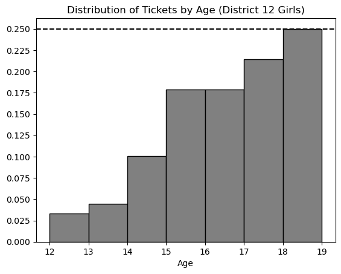

# BEGIN PROB

In an annual ceremony known as the reaping, tributes are selected to
represent their district in the Hunger Games. One male and one female
tribute from each district are randomly selected via a lottery drawing.

Every child between the ages of $12$ and $18$ (inclusive) has tickets
entered into the drawing for their sex and district (e.g. girls from
District 12). The number of tickets entered is dependent on age.

Starting at age $12$, each child receives one ticket in the lottery. For
each year after that, they receive one additional ticket, added to the
total from the previous year. For example, $13$-year-olds have two
tickets, $14$-year-olds have three tickets, and so on.

In this problem, we will consider only tickets corresponding to girls
from District $12$, and look at the distribution of these tickets
according to the age of the person they represent. A density histogram
for these tickets is shown below.

# BEGIN SUBPROB

Which of the following statements about this distribution is correct?

( ) The mean is less than the median.
( ) The mean is the same as the median.
( ) The mean is greater than the median.
( ) It is impossible to determine the relationship between the mean and
the median with the given information.

# BEGIN SOLUTION

**Answer**: The mean is less than the median

The histogram shows us that most of the tickets are for older girls i.e. girls that are of ages 17 to 19. It also shows us that there are fewer tickets for the younger girls. When most of the values are larger, the median is larger than the mean because the small values tend to pull the mean down.

<average>70</average>

# END SOLUTION

# END SUBPROB

The histogram from the previous page is repeated below for your
reference.

# BEGIN SUBPROB

Suppose the rules of the Hunger Games were changed to eliminate
$18$-year-olds. If we plotted a new density histogram of the
distribution of ages for tickets corresponding to girls from District
12 aged $12$ to $17$, how would the height of the `[13, 14)` bar
change?

Let $h$ be the height of this bar in the original histogram. Give its
height in the new histogram in terms of $h$.

# BEGIN SOLUTION

**Answer**: $4/3 * h$

The total area under a density histogram is $1$. Using this bit of information, when the 18 year olds are removed we have to scale the the remaining bars so that the area of our density histogram is still $1$. Notice the height of the exempt bar is $0.25$ meaning that the remaining data is exactly $3/4$ th of the original data. To rescale we need to divide the height $h$ of each bar by $3/4$ or multiply $h$ by $4/3$.

<average>40</average>

# END SOLUTION

# END SUBPROB # BEGIN SUBPROB

What is the **most common age** among girls from District 12 aged $12$
to $18$? Remember, the distribution above is for all tickets, and older
girls have more tickets.

( ) 12 
( ) 13 
( ) 14 
( ) 15 
( ) 16 
( ) 17 
( ) 18

# BEGIN SOLUTION

**Answer**: 15

For this problem we need to calculate which bar has the most amount of girls within the bar keeping in mind that each age group gets a different amount of tickets. To do this we can calculate the proportion of girls in each bar relative to the total ticket distribution by dividing the height of each bar by the number of tickets allocated to that bar. The bar for age 15 comes out to the largest with a value of $0.045$, and therefore that is our solution.

<average>75</average>

# END SOLUTION

# END SUBPROB

# END PROB