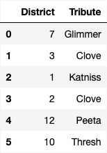

# BEGIN PROB

The night before the Hunger Games begins, each tribute is interviewed in
front of a live audience. During this interview, the host asks each
tribute a few personal questions and reveals their overall score from
the training camp. These interviews are broadcast across the country, so
that the residents of Panem can get to know the tributes better and form
opinions about who they want to win.

The Capitol wants to understand public perceptions of the tributes after
the interviews for the 74th Hunger Games. They conduct a survey of a
sample of residents from all 12 districts, asking them two questions:

1.  "What district do you live in?\"

2.  "Who do you think will win this year's Hunger Games?\"

The survey results are in the DataFrame `survey`, with columns
`"District"` and `"Tribute"` which contain each person's answers to the
two questions above. The first few rows of `survey` are shown below.

<center></center>

In this problem, we will try to estimate the proportion of residents
from a given district who think a certain tribute will win the Hunger
Games.

# BEGIN SUBPROB

What proportion of residents in District 11 think Peeta will win? Write
**one line of code** that evaluates to this proportion **in our
sample**, based on the data in `survey`.


# BEGIN SOLUTION

**Answer**: `survey[(survey.get("Tribute") == "Peeta") & (survey.get("District") == 11)].shape[0] / survey[survey.get("District") == 11].shape[0]`

This question is just a whole lot of querying. For the numerator we want all the people who answered the survey who are from district 11 and votes for Peeta. We can do this by querying on those two conditions and taking the shape. For the denominator we want all the people from district 11 who answered the survey, so we query for that in the denominator and take the shape.

<average>78</average>

# END SOLUTION

# END SUBPROB

# BEGIN SUBPROB

Next, we want to create a 95% confidence interval for the proportion of
**all** residents from a given district who think a certain tribute will
win. Fill in the blanks in the function `win_CI` below. This function
takes the name of a tribute and the number of a district and returns the
endpoints of a 95% bootstrapped confidence interval for the proportion
of all residents of that district who think that tribute will win, based
on the data in `survey`.

For example `win_ci("Peeta", 11)` returns the endpoints of a 95%
confidence interval for the proportion of all residents from District 11
who think Peeta will win.

```py
def win_ci(tribute, district):
            only_district = survey[survey.get("District") == district]
            props = np.array([])
            for i in np.arange(10000):
                resample = __(a)__
                tribute_count = __(b)__
                boot_prop = tribute_count / __(c)__
                props = np.append(props, boot_prop)
            return [np.percentile(props, 2.5), np.percentile(props, 97.5)]
```

# BEGIN SOLUTION

`(a)`: `only_district.sample(only_district.shape[0], replace=True)`

 For the first blank we have to create a bootstrapped sample from just the rows in the given district. We sample with replacement here as we do when we bootstrap to keep the same number of rows. That being said we use the `.sample` function with replacement to get our sample from the `only_district` dataframe containing the rows in the given district. Within our sample we want the number of rows to be the same size as the `only_district` dataframe. so we set the size argument to be `only_district.shape[0]`.

`(b)`: `resample[resample.get("Tribute") == tribute].shape[0]`

Now we want to find how many times the given tribute appears in the bootstrapped sample. To do that we query the dataframe for the given tribute and the take the size of our query using `.shape[0]`.

`(c)`: `resample.shape[0]`

The denominator of our resample is just the total number of people in the resample. That being said to fill this blank all we need to do is use `.shape[0]` to take the size of the resample.

<average>59</average>

# END SOLUTION

# END SUBPROB

# BEGIN SUBPROB

Suppose we were to plot a histogram of `props` within the function
`win_CI`. Which of the following best describes this histogram?

( ) The histogram reflects the shape of the population.
( ) The histogram reflects the shape of the data in `survey`.
( ) The histogram reflects the shape of the data in `survey` which corresponds to the given district.
( ) The histogram is roughly normal because of the Central Limit Theorem (CLT).
( ) The histogram is roughly normal, but not because of the CLT.

# BEGIN SOLUTION

**Answer**: The histogram is roughly normal because of the Central Limit Theorem (CLT).

The props histogram shows the ditribution of proportions from a bunch of random resamples. Per the CLT, the distribution of sample stats like proportions will be basically normal, regardless of the shape of the original dataset.

<average>53</average>

# END SOLUTION

# END SUBPROB

# BEGIN SUBPROB

Suppose we now compute the following:

>>> `win_ci("Katniss", 4)`

>>> [0.25, 0.72]

>>> `win_ci("Katniss", 12)`

>>>[0.50, 0.70]

Which of the following reasons best explains why the second interval is
narrower than the first?

( ) More people live in District 12 than District 4.
( ) More people live in District 4 than District 12.
( ) A greater fraction of District 12 residents than District 4 residents think Katniss will win.
( ) A greater fraction of District 4 residents than District 12 residents think Katniss will win.
( ) There are more survey participants from District 12 than District 4.
( ) There are more survey participants from District 4 than District 12.

# BEGIN SOLUTION

**Answer**: There are more survey participants from District 12 than District 4.

Confidence intervals get narrower when there is an increase in sample size. This is because the variation present in the bootstrapped estimates is smaller. Therefore, we can say there were more survey participants from District 12 than District 4.

<average>68</average>

# END SOLUTION

# END SUBPROB

# BEGIN SUBPROB

Suppose we want to redo our survey so that our confidence interval for
the proportion of District 12 residents who think Katniss will win has a
width of at most $0.10$. We will assume that our new sample's standard
deviation will be the same as our original sample's standard deviation.
Which of the following best describes how to achieve this?

( ) Our new sample should have twice as many people from District 12. It doesn't matter how many people the sample contains overall.
( ) Our new sample should have four times as many people from District 12. It doesn't matter how many people the sample contains overall.
( ) Our new sample should have twice as many people overall. It doesn't matter how many of them are from District 12.
( ) Our new sample should have four times as many people overall. It doesn't matter how many of them are from District 12.

# BEGIN SOLUTION

**Answer**: Our new sample should have four times as many people overall. It doesn't matter how many of them are from District 12.

The width of our confidence interval is determined by the standard error which decreases at the factor of $\frac{1}{\sqrt(n)}$ to half the width, we need the denominator to increase by a factor of 2. Therefore, we need 4x more data, as the square root of 4 is 2.

<average>75</average>

# END SOLUTION

# END SUBPROB

# END PROB