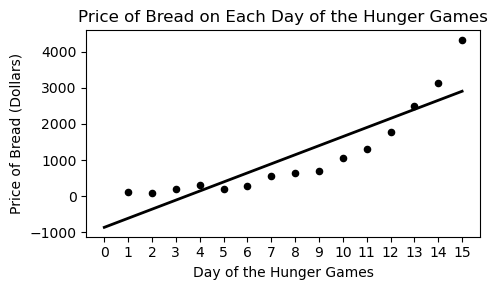
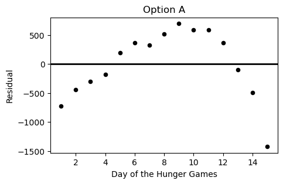
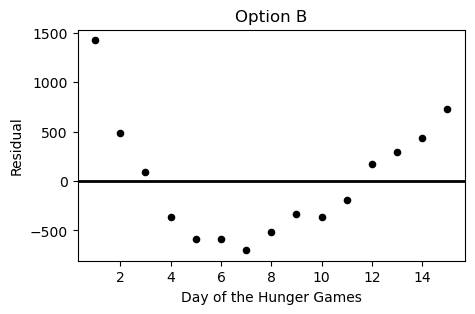
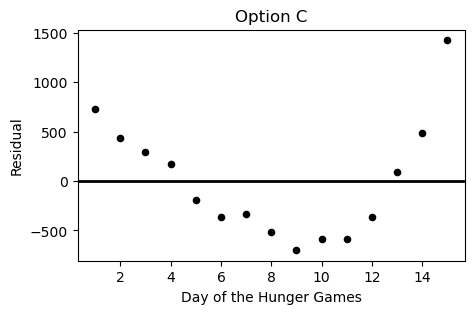
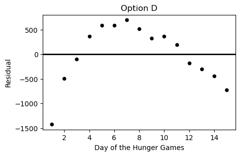

# BEGIN PROB

During the Hunger Games, sponsors may purchase supplies for the tributes
competing. However, supplies increase in price as the Hunger Games
progress. Haymitch collects data on the price, in dollars, of purchasing
bread for a tribute over the first $15$ days of the Hunger Games
competition. He uses linear regression to predict the price of bread
based on the day of the competition. His regression line is shown below
on a scatterplot of the data.

# BEGIN SUBPROB

Which of the following plots is the residual plot for the data above?

( ) Option A
( ) Option B 
( ) Option C 
( ) Option D

# BEGIN SOLUTION

**Answer**: Choice C

This choice is correct because the curve in the original scatter plot has a steeper slope at beginning and end, but is actually below the regression line in the middle. This creates positive residuals at the beginning/end and negative residuals in the middle. This eliminates choices A & D. Between choices B & C, we want the negative region of the residual plot ot fall between the fifth and thirteenth days of the hungers games. Only choice C satisfies this.

# END SOLUTION

# END SUBPROB 

# BEGIN SUBPROB

What conclusions can Haymitch draw from looking at the residual plot of his regression line? Select all that apply.

[ ] The correlation coefficient between these variables is weak ($r<0.5$).
[ ] A line is not the best choice to model the relationship between these variables.
[ ] There is a different line that fits the data better than this line.
[ ] None of the above.

# BEGIN SOLUTION

**Answer**: Choice 2

The only one of the choices here we can really say for sure is true is Choice B and that is because there is a curved pattern in our residual plot telling us that our straight regression line is missing a trend in the data that a nonlinear model would likely capture. This line of reasoning immidiately also eliminates Choice C, as the curved trend exhibited in the residuals means that no straight line will fit the data better than a nonlinear model. Finally the first choice is also incorrect, because regardless of the trend shown on the residual plot we could still have a strong correlation coefficient.

# END SOLUTION

# END SUBPROB

# BEGIN SUBPROB

Haymitch wants to present the scatter plot to potential sponsors, but he
wants to give the prices in thousands of dollars instead of dollars. He
divides each of the $15$ prices in his data set by $1000$, then
recalculates the regression line. Which of the following statements are
correct? Select all that apply.

[ ] The mean of the prices will be divided by $1000$.
[ ] The standard deviation of the prices will be divided by $1000$.
[ ] The slope of the regression line predicting price from day will be divided by $1000$.
[ ] The intercept of the regression line predicting price from day will be divided by $1000$.
[ ] The slope of the regression line predicting price in standard units from day in standard units will be divided by $1000$.
[ ] The root mean square error (RMSE) of the regression line will be divided by $1000$.
[ ] None of the above.

# BEGIN SOLUTION

**Answer**: Choices 1, 2, 3, 4, 6

Choices 1-4 & 6 are correct because when we divide the y variable by 1000, then all of the y variable based quantities will be also scaled down by 1000. This means the mean, std, slope, intercept, and RMSE will all also be scaled down. 

Choice 5 is not correct because under standard units, the slope is equal to the correlation coefficient which is resilient to how we scale the units on the graph.

# END SOLUTION

# END SUBPROB

# END PROB