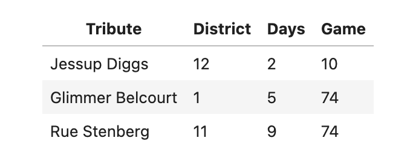

# BEGIN PROB

\[(13 pts)\]

In certain districts ($1$, $2$, and $4$), children spend years training
for the Hunger Games and frequently volunteer to participate in them.
Tributes that come from these districts are known as **Career
tributes**. Many residents of Panem believe that Career tributes
generally fare better in the Hunger Games because of their extensive
training.

We'll test this claim using historical data. The DataFrame `survival`
has a row for each tribute who participated in one of the first $74$
Hunger Games. The columns are as follows:

-   `"Tribute"`: The name of the tribute.

-   `"District"`: Their home district ($1$--$12$).

-   `"Days"`: The number of days they stayed alive in the arena.

-   `"Game"`: The Hunger Games edition they competed in ($1$--$74$).

A few rows of `survival` are shown below:

<center></center>

We'll use this data to test the following pair of hypotheses:

-   **Null Hypothesis**: On average, Career tributes and non-Career
    tributes survive an equal amount of time in the arena.\

-   **Alternative Hypothesis**: On average, Career tributes survive
    **longer** in the arena than non-Career tributes.

Our test statistic will be the mean survival time of Career tributes
minus the mean survival time of non-Career tributes

# BEGIN SUBPROB

Write code to create a DataFrame called `tributes` that has all the data
in `survival` plus an additional column called `"Career"`. This column
should contain boolean values indicating whether each tribute is
considered a Career tribute. Feel free to define intermediate variables
and functions as needed, and to do this in multiple lines of code.


# BEGIN SOLUTION

**Answer**: 
```py 
def is_career(d): 
    if d==1 or d==2 or d==4: 
        return True 
    else:
        return False 
tributes = survival.assign(Career=survival.get('District').apply(is_career))
```

A quick explaination here would be saying that inorder to have a new column where we can decipher if a given tribute is a career tribute or not, we need a function that tells us if a tribute is a career tribute based on the district they are located in. To do this, all we need to do is check for any given tribute if they are in districts 1, 2, or 4 using our function, meaning we need to build our function and then apply it to the district series. We can then just assign the output series back to the original dataframe.

<average>65</average>

# END SOLUTION

# END SUBPROB

# BEGIN SUBPROB

Fill in the blanks in the code below so that `statistics` evaluates to
an array with 10000 simulated values of the test statistic under the
null hypothesis.

```py
statistics = np.array([])

for i in np.arange(10000):
    shuffled = tributes.assign(__(a)__)
    means = shuffled.groupby("Career").mean().get("Days")
    stat = __(b)__
    statistics = np.append(statistics, stat)
```

# BEGIN SOLUTION
**Answer**:

`(a): np.random.permutation(tributes.get("Days))`

`(b): means.loc[True] - means.loc[False]`

In blank a we shuffle one of the columns so as to break any real link between the Career column and the Days column. This allows us to simulate our null hypothesis. After this in blank b, we use `means.loc[True] - means.loc[False]` to get the difference in mean survival days between career and non-career tributes. This is our test statistic.

<average>63</average>

# END SOLUTION

# END SUBPROB

# BEGIN SUBPROB

The output of `tributes.groupby("Career").mean()` is shown below.

<center></center>

Fill in the blank below to compute the p-value of this test.

```py
p_value = (__(a)__).mean()
```

# BEGIN SOLUTION
**Answer**:

`(a): statistics >= 0.6`

Our observed statistic can be calculated by taking the difference in means from the `Days` column. In this case that is $5.2 - 4.6 = 0.6$. We want all of the simulated values that are at least as extreme as this observed value. Therefore we want all values from the `statistics` array >= 0.6.

<average>63</average>

# END SOLUTION

# END SUBPROB

# END PROB