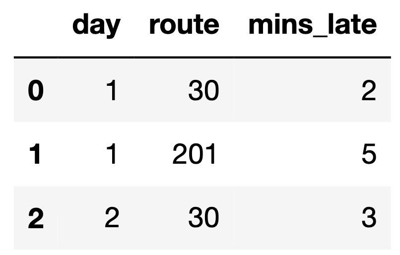

# BEGIN PROB
Every year, the American Kennel Club holds a Photo Contest for dogs.
Eric wants to know whether **toy dogs win disproportionately more
often than other kinds of dogs.** He has collected a sample of 500 dogs
that have won the Photo Contest. In his sample, 200 dogs were toy dogs.

Eric also knows the distribution of dog kinds in the population:

<center></center>

# BEGIN SUBPROB

Select all correct statements of the null hypothesis.

[ ] The distribution of dogs in the sample is the same as
the distribution in the population. Any difference is due to
chance.
[ ] Every dog in the sample was drawn uniformly at random without replacement 
from the population.
[ ] The number of toy dogs that win is the same as the number of toy dogs in 
the population.
[ ] The proportion of toy dogs that win is the same as the proportion of toy 
dogs in the population.
[ ] The proportion of toy dogs that win is 0.3.
[ ] The proportion of toy dogs that win is 0.5.

# BEGIN SOLUTION

**Answer: ** Options 4 & 5

A null hyopthesis is a the hypothesis that there is no significant difference between populations. Let's consider what a potential null hypothesis might look like. A potential null hypothesis would be that there are is no difference between the win proportion of toy dogs compared to the proportion of toy dogs in the population.

Option 1: We're not really looking at the distribution of dogs in our sample vs dogs in our population, rather, we're looking at whether whether toy dogs win more than other dogs. In other words, the only factors we're really consdiering are the proportion of toy dogs to normal dogs, as well as the win percentages of toy dogs to normal dogs; and so the distribution of the population doesn't really matter. Furthermore, this option makes no refereance to win rate of toy dogs.

Option 2: This isn't really even a null hypothesis, but rather more of a description of a test procedure. This option also makes no attempt to refereance to win rate of toy dogs.

Option 3: This statement doesn't really make sense in that it is illogical to compare the raw number of toy dogs wins to the number of toy dogs in the population, because the number of toy dogs is always at least the number of toy dogs that win. Rejecting this null hypothesis would only reject an extreme case within the subset of what we're trying to prove.

Option 4: This statement is in line with the null hypothesis.

Option 5: This statement is another potential null hypothesis since the proportion of toy dogs in the population is 0.3.

Option 6: This statement, although similar to Option 5, would not be a null hypothesis because 0.5 has no relevance to any of the relevant proportions. (While it's true that if the proportion of of toy dogs that win is over 0.5, we could maybe infer that toy dogs win the majority of the times; however, the question is no to determine whether toy dogs win most of the times, but rather if toy dogs win a disproportionately high number of times relative to its population size.)

# END SOLUTION

# END SUBPROB

# BEGIN SUBPROB

Select the correct statement of the alternative hypothesis.

( ) The model in the null hypothesis underestimates how often toy dogs win.
( ) The model in the null hypothesis overestimates how often toy dogs win.
( ) The distribution of dog kinds in the sample is not the same as the population.
( ) The data were not drawn at random from the population.

# BEGIN SOLUTION

**Answer: ** Option 1

The alternative hypothesis is the hypothesis we're trying to support, which in this case is that toy dogs happen to win more than other dogs.

Option 1: This is in line with our alternaticve hypothesis, since proving that the null hypothesis underestimates how often toy dogs win means that toy dogs win more than other dogs.

Option 2: This is the opposite of what we're trying to prove.

Option 3: We don't really care too much about the distribution of dog kinds, since that doesn't help us determine toy dog win rates compared to other dogs.

Option 4: This isn't a hypothesis, rather, it's more of a description of a procedure.

# END SOLUTION

# END SUBPROB

# BEGIN SUBPROB

Select all the test statistics that Eric can use to conduct his hypothesis.

[ ] The proportion of toy dogs in his sample.
[ ] The number of toy dogs in his sample.
[ ] The absolute difference of the sample proportion of toy dogs and 0.3.
[ ] The absolute difference of the sample proportion of toy dogs and 0.5.
[ ] The TVD between his sample and the population

# BEGIN SOLUTION

**Answer: ** Option 1

Option 1: This option is correct. According to our null hypothesis, we're trying to compare the proportion of toy dogs win rates to the proportion of toy dogs. Thus taking the proportion of toy dogs in Eric's sample is a perfectly valid test statistic.

Option 2: This option is incorrect. The raw number of toy dogs in his sample doesn't really tell us how much toy dogs are winning compared to the rest of the population. Looking back at our null hypothesis, we're trying to compare two proportions.

Option 3: This option is incorrect. The absolute difference of the sample proportion of toy dogs and 0.3 doesn't help us becuase the absolute difference won't tell us whether or not the sample proportion of toy dogs is lower than 0.3 or higher than 0.3.

Option 4: This option is incorrect for the same reasoning as above, but also 0.5 isn't a relavent number anyways.

Option 5: This option is incorrect. Again, total variation distance won't help us tell whether or not the toy dogs have a disproportionately higher or lower winrate. 

# END SOLUTION

# END SUBPROB

# BEGIN SUBPROB

Eric decides on this test statistic: the proportion of toy dogs
minus the proportion of non-toy dogs. What is the observed value of
the test statistic?

( ) $-0.4$
( ) $-0.2$
( ) $0$
( ) $0.2$
( ) $0.4$

# BEGIN SOLUTION

**Answer: ** Option 2: -0.2

For our given sample, the proportion of toy dogs is $0.4$ and the proportion of non-toy dogs is $0.6$ so 
$0.4 - 0.6 = -0.2$

# END SOLUTION

# END SUBPROB

# BEGIN SUBPROB

Which snippets of code correctly compute Eric's test statistic on one simulated sample under the null hypothesis? Select all that apply. The result must be stored in the variable `stat`.

[ ] Snippet 1:
```py
a = np.random.choice([0.3, 0.7])
b = np.random.choice([0.3, 0.7])
stat = a - b
```
[ ] Snippet 2:
```py
a = np.random.choice([0.1, 0.2, 0.3, 0.2, 0.15, 0.05])
stat = a - (1 - a)
```
[ ] Snippet 3:
```py
a = np.random.multinomial(500, [0.1, 0.2, 0.3, 0.2, 0.15, 0.05]) / 500
stat = a[2] - (1 - a[2])
```
[ ] Snippet 4:
```py
a = np.random.multinomial(500, [0.3, 0.7]) / 500
stat = a[0] - (1 - a[0])
```
[ ] Snippet 5:
```py
a = df.sample(500, replace=True)
b = a[a.get("kind") == "toy"].shape[0] / 500
stat = b - (1 - b)
```

# BEGIN SOLUTION

**Answer: ** Snippet 3 & Snippet 4

Snippet 1: This is incorrect because `np.random.choice` only chooses between the values $0.3$ and $0.7$ which simply just wrong.

Snippet 2: This is wrong because `np.random.choice` only chooses from the values within the lis. From a sanity check it's not hard to realize that `a` should be able to take on more values than the ones simply in the list.

Snippet 3: This option is correct. `np.random.multinomial` generates a sample of 500 objects according to the given distribution (which is the same as the total population distribution). We divide the first line by 500 to convert our the values in our resulting array into proportions. To access the proportion of toy dogs in our sample, we simply take the entry with the probability ditribution value of $0.3$, which is the third entry in the array or `a[2]`. To calculate our test statistic we simply take the proportion of toy dogs miinus the proportion of non-toy dogs or `a[2] - (1 - a[2])`

Snippet 4: This option is correct. This approach is similar to the one above except we're only considering the probability distribution of toy dogs vs non-toy dogs which is what we wanted in the first place. The rest of the steps are similar to the ones aboce.

Snippet 5: Note that `df` is simple just a datafram containing information of the dogs, and may or may not reflect the population distribution of dogs that participate in the photo contest. 

# END SOLUTION

# END SUBPROB

# BEGIN SUBPROBLEM

After simulating, Eric has an array called `sim` that stores
his simulated test statistics, and a variable called `obs`
that stores his observed test statistic.

What should go in the blank to compute the p-value?

```py
np.mean(sim _______ obs)
```

( ) `<`
( ) `<=`
( ) `==`
( ) `>=`
( ) `>`

# BEGIN SOLUTION

**Answer: ** Option 4: `>=`

Note that to calculate the p-value we look for test statistics that are equal to or more extreme that the observed statistic. In this case, if the proportion of the population of toy dogs compared to the rest of the dog population was higher than observed, we'd get a value larger than $0.2$, and thus we use `>=`.

# END SOLUTION

# END SUBPROBLEM

# BEGIN SUBPROBLEM

Eric's p-value is 0.03. If his p-value cutoff is 0.01, what does he
conclude?

( ) He rejects the null in favor of the alternative.
( ) He accepts the null.
( ) He accepts the aleternative.
( ) He fails to reject the null.

# BEGIN SOLUTION

**Answer: ** Option 4: He fails to reject the null

Option 1: Note that since our p-value was greater than 0.01, we fail to reject the null.
Option 2: We can never "accept" the null hypothesis.
Option 3: We didn't accept the alternative since we failed to reject the null.
Option 4: This option is correct becuase our p-value was larger than our cutoff.

# END SOLUTION

# END SUBPROBLEM

# END PROB
